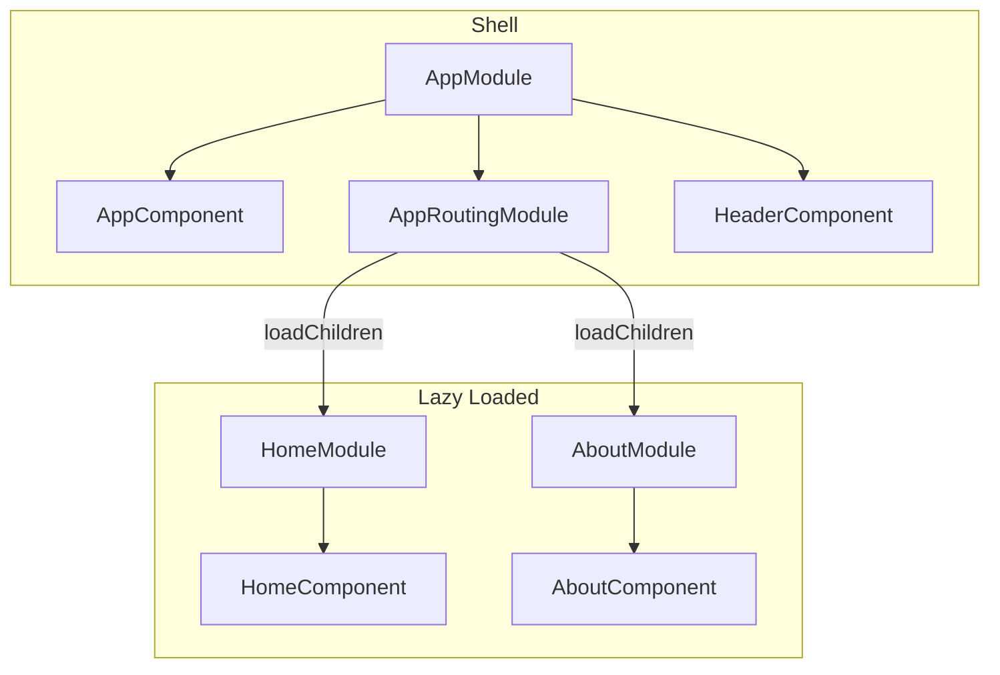

# Template-Angular-v21

[](https://angular.dev/)
[](https://www.typescriptlang.org/)
[](https://vitest.dev/)
[](https://eslint.org/)
[](https://prettier.io/)
[](LICENSE)

> Angular 21 template with NgModule architecture, lazy-loaded routes, BEM CSS, and full developer tooling.

## Features

- **Angular 21.1** — NgModule-based architecture (`standalone: false`)
- **TypeScript 5.9** — Strict mode with Angular strict templates
- **Lazy loading** — Feature modules loaded on-demand via `loadChildren`
- **BEM CSS** — Component-scoped styles with `.block__element--modifier` convention
- **Angular Signals** — `signal()` and `computed()` for reactive state
- **Design tokens** — CSS custom properties in `:root` for consistent theming
- **Vitest 4.x** — Fast unit testing via `@angular/build:unit-test`
- **ESLint 9 + Prettier** — Code quality and formatting out of the box
- **Husky + lint-staged** — Pre-commit hooks enforce lint and format checks
- **Path aliases** — `@app/`, `@shared/`, `@pages/`, `@env/` for clean imports

## Quick Start

```bash
git clone https://github.com/jmrg-link/template-angular-v21.git
cd template-angular-v21
npm install
npm start
```

Open [http://localhost:4200](http://localhost:4200) in your browser.

## Commands

| Command                | Description                                      |
| ---------------------- | ------------------------------------------------ |
| `npm start`            | Dev server at `http://localhost:4200`            |
| `npm run build`        | Production build to `dist/template-angular-v21/` |
| `npm test`             | Run unit tests (Vitest)                          |
| `npm run lint`         | ESLint check                                     |
| `npm run lint:fix`     | ESLint auto-fix                                  |
| `npm run format`       | Format with Prettier                             |
| `npm run format:check` | Check formatting without writing                 |
| `npm run watch`        | Dev build with watch mode                        |

## Architecture



The app bootstraps through `AppModule`, which declares the shell components and imports `AppRoutingModule`. Feature pages are **lazy-loaded** — `HomeModule` and `AboutModule` are only fetched when the user navigates to their routes.

 <details>
 <summary><strong>Project Structure</strong></summary>

```tree
src/
├── main.ts                          # Entry point (module bootstrap)
├── index.html                       # Shell HTML (Inter font via Google Fonts)
├── styles.css                       # Global design tokens + CSS reset
├── environments/
│   ├── environment.ts               # Development config
│   └── environment.prod.ts          # Production config (fileReplacements)
└── app/
    ├── app.module.ts                # Root NgModule
    ├── app-routing.module.ts        # Router with lazy-loaded routes
    ├── app.component.ts/html/css    # Layout shell (layout + footer blocks)
    ├── app.component.spec.ts        # Root component tests
    ├── core/                        # Singleton services, guards, interceptors
    │   ├── services/
    │   ├── guards/
    │   └── interceptors/
    ├── pages/                       # Lazy-loaded feature modules
    │   ├── home/                    # HomeModule + HomeComponent
    │   └── about/                   # AboutModule + AboutComponent
    └── shared/
        └── components/
            └── header/              # HeaderComponent (navbar block)
```

</details>

## Path Aliases

| Alias       | Path                   | Usage                                |
| ----------- | ---------------------- | ------------------------------------ |
| `@app/*`    | `./src/app/*`          | App-level modules and components     |
| `@shared/*` | `./src/app/shared/*`   | Shared components, pipes, directives |
| `@pages/*`  | `./src/app/pages/*`    | Page feature modules                 |
| `@env/*`    | `./src/environments/*` | Environment configuration            |

Configured in `tsconfig.json` using `paths` with `./src/` prefix (no `baseUrl`).

<details>
<summary><strong>Design Tokens</strong></summary>

All colors, spacing, shadows, and typography are defined as CSS custom properties in `styles.css`:

| Token               | Value       | Usage                    |
| ------------------- | ----------- | ------------------------ |
| `--primary-color`   | `#3b82f6`   | Primary actions, links   |
| `--primary-dark`    | `#1d4ed8`   | Hover states on primary  |
| `--secondary-color` | `#64748b`   | Secondary text, icons    |
| `--accent-color`    | `#f59e0b`   | Highlights, badges       |
| `--bg-color`        | `#f8fafc`   | Page background          |
| `--surface-color`   | `#ffffff`   | Card/section backgrounds |
| `--text-main`       | `#1e293b`   | Primary text             |
| `--text-muted`      | `#64748b`   | Secondary/muted text     |
| `--border-color`    | `#e2e8f0`   | Borders and dividers     |
| `--spacing-xs`      | `0.5rem`    | Tight spacing            |
| `--spacing-sm`      | `1rem`      | Default spacing          |
| `--spacing-md`      | `1.5rem`    | Medium spacing           |
| `--spacing-lg`      | `2rem`      | Large spacing            |
| `--spacing-xl`      | `3rem`      | Section spacing          |
| `--border-radius`   | `8px`       | All rounded corners      |
| `--shadow-sm`       | `0 1px 3px` | Cards, subtle elevation  |
| `--shadow-md`       | `0 4px 6px` | Dropdowns, modals        |
| `--font-main`       | `Inter`     | All UI text              |
| `--font-code`       | `Fira Code` | Code blocks              |

Always use these tokens instead of hardcoded values in component styles.

</details>

## BEM CSS Convention

All component styles follow the **BEM** (Block, Element, Modifier) naming convention. Each Angular component maps to one BEM block.

> [!TIP]
> **Naming rule:** `.block__element--modifier` — one block per component, flat selectors only, no nesting beyond one element level.

```css
/* Block */
.navbar {
}

/* Elements */
.navbar__link {
  color: var(--text-main);
}
.navbar__logo {
  font-weight: 700;
}

/* Modifiers */
.navbar__link--active {
  color: var(--primary-color);
}
```

```html
<!-- Modifiers always accompany the base class -->
<a class="navbar__link navbar__link--active">Home</a>
```

No `!important`, no inline styles, no generic class names like `.title` or `.btn`.

## Environments

The project uses Angular's `fileReplacements` in `angular.json` to swap environment files at build time:

- **Development:** `src/environments/environment.ts` — used by `npm start`
- **Production:** `src/environments/environment.prod.ts` — used by `npm run build`

```typescript
// src/environments/environment.ts
export const environment = {
  production: false,
};
```

## Development

### Lint and Format

```bash
npm run lint           # Check for lint errors
npm run lint:fix       # Auto-fix lint errors
npm run format         # Format all source files
npm run format:check   # Verify formatting without changes
```

### Testing

```bash
npm test               # Run all unit tests with Vitest
```

Tests are colocated with their source files (`*.spec.ts`) and use `TestBed.configureTestingModule()` with explicit `declarations` for module-based components.

### Building

```bash
npm run build          # Production build → dist/template-angular-v21/
```

## Git Hooks

**Husky** and **lint-staged** run automatically on every commit:

- `.ts` and `.html` files are linted with ESLint (`--fix`) and formatted with Prettier
- `.css`, `.json`, and `.md` files are formatted with Prettier

This keeps the codebase consistent without manual checks.

## Contributing

> [!NOTE]
> This project uses **Conventional Commits** for all commit messages:
> `type(scope): description`
>
> Types: `feat`, `fix`, `docs`, `style`, `refactor`, `test`, `chore`
>
> Example: `feat(home): add hero section with CTA button`

1. Fork the repository
2. Create a feature branch: `git checkout -b feature/your-feature`
3. Make your changes and commit using conventional commits
4. Run `npm run lint && npm test` to verify
5. Open a Pull Request

## License

MIT

## Author

**Jes&uacute;s Mar&iacute;a Rico Gonz&aacute;lez** — [jmrg.dev](https://www.jmrg.dev)

[](https://github.com/jmrg-link)
[](https://linkedin.com/in/jesus-maria-rico-gonzalez)
